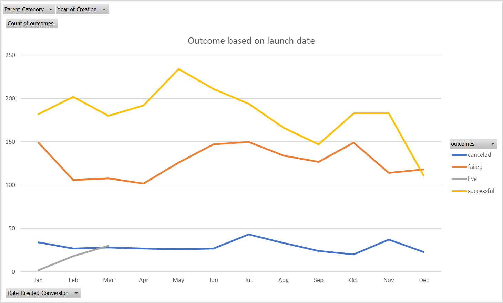
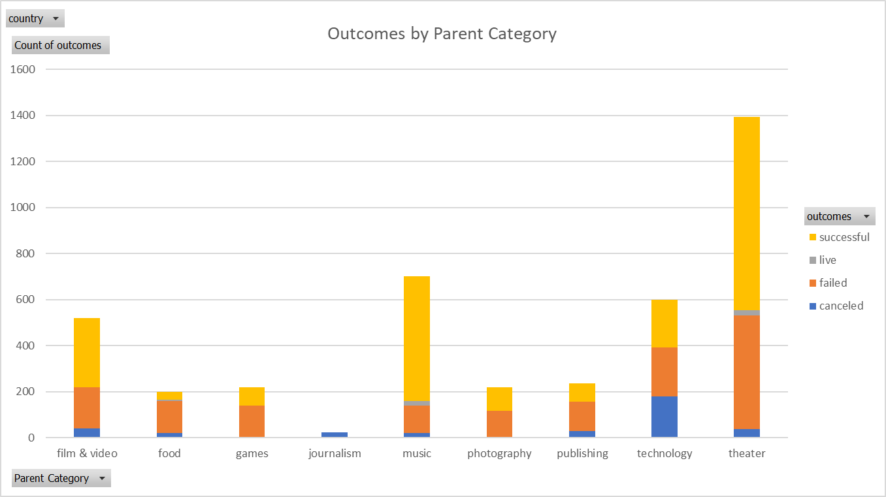

# Analysis of kickstarter campaigns in the performing arts
---
#### In service of recommending optimal timing and budget of theatrical kickstarters in the United States and Great Britain.
---
## Findings
In the United States, theater kickstarters are easily the most numerous, with roughly double the number of total kickstarters as the next highest category (~1400).  More than half of these theater kickstarters are successful, with the most common launch dates for successful kickstarters occurring in the Spring.

