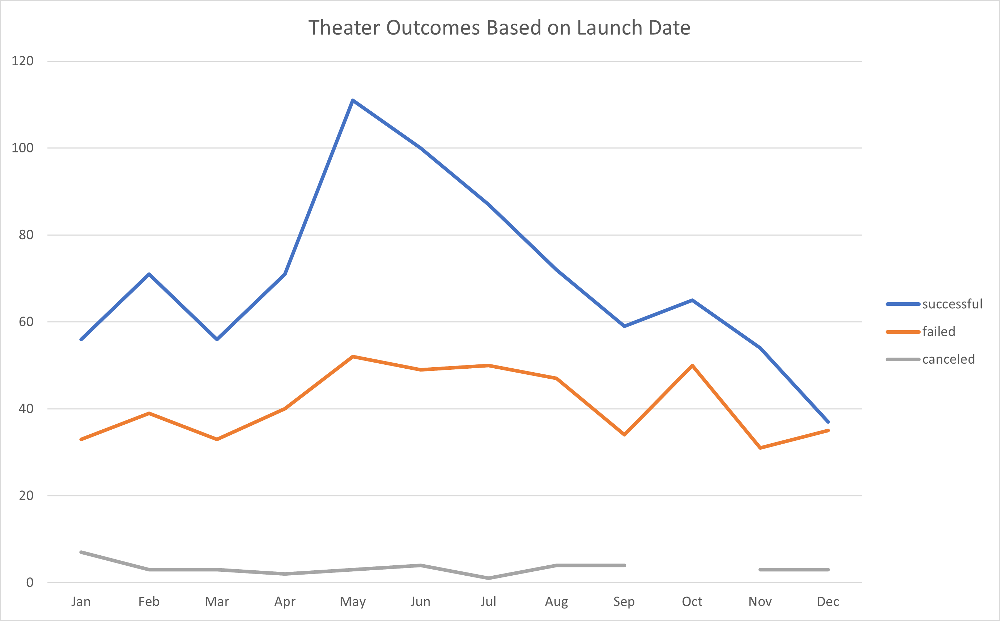
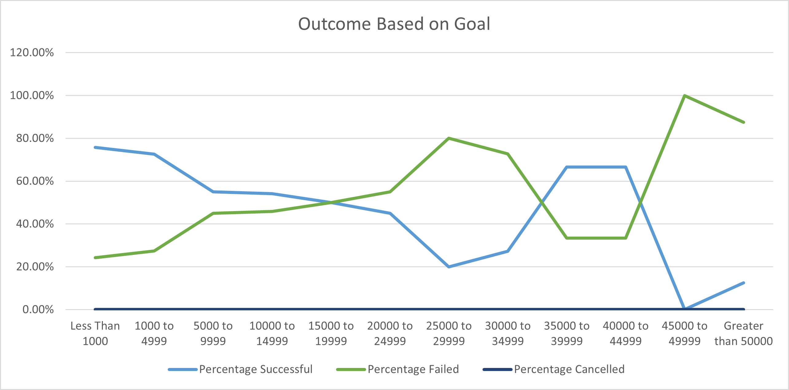

# Kickstarting with Excel

## Overview of Project

### Purpose

This analysis was conducted in order to determine the optimal timing and funding goals for Kickstarter projects related to the theater in the US and Great Britain.  Analysis was compiled for a playwright in Britain investigating 

Data is derived from data from more than 4,000 Kickstarter campaigns compiled from 2009 through 2017.  Analysis was conducted using MIcrosoft Excel.

## Analysis and Challenges

### Analysis of Outcomes Based on Launch Date

Data set was segmented by month (irrespective of year), as well as three of the four kickstarter statuses: successful, failed, canceled.  Kickstarters that were currently live were ignored for this data set.

### Analysis of Outcomes Based on Goals

Analysis was conducted using successful, failed, canceled, and segmented into numerical ranges in intervals of $5,000.

### Challenges and Difficulties Encountered

Data required cleanup in order to properly segment the theater category, as categories and subcategories were bundled in one data point.  Identifying outliers?  no challenges??

## Results

### conclusions on seasonality

Based on the analysis, May is the most successful month for launching kickstarters, with 111 successful kickstarters, followed by June.  Late spring and early summer is the most successful campaign season.  December sees by far the least successes, with only 37 successful kickstarters.

Seasonality has less of an impact on failure rate.  December is the least successful month for kickstarter campaigns, presumably due to crowding out from holiday season spending.

### conclusions on outcomes based on goals

Generally speaking, the smaller a campaign's goal amount is, the more likely it is to succeed.  Kickstarters with funding goals less than $10,000 are the only ones with a higher than 50% success rate, with campaigns less than $1,000 having a 71% success rate.

Extremely large campaigns (more than $50,000 goals) are more likely to be cancelled than derp.

### limitations

Some limitations in the data set include a lack of reasons for cancellation.  With more data on what drove a funder to cancel a Kickstarter campaign.  Current analysis operates on the assumption that lack of funding is a potential driver for cancellation.  Other reasons may have a material impact on this analysis.

Additionally, for the purposes of this analysis, any data regarding the play's genre would presumably be helpful in further targeting.

Further data regarding the subsequent outcome

Genres do not exist.

### other possible studies

Something about percentage funded?

Duration of campaign

Years

