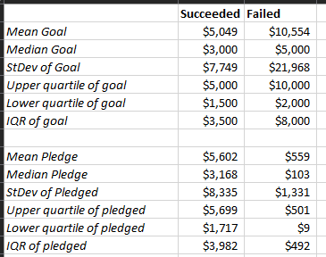
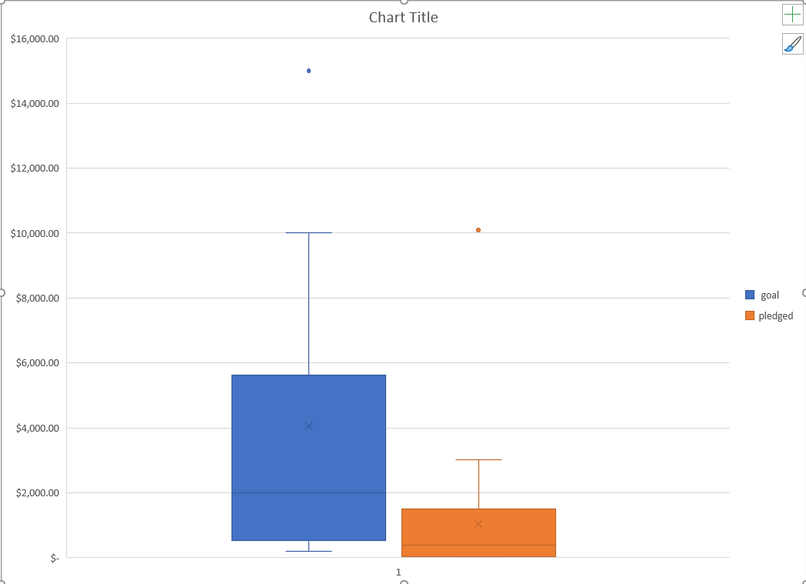

# Analysis of kickstarter campaigns in the performing arts

## Purpose of project

  This project was commissioned in service of recommending optimal timing and budget of kickstarters for new plays in the United States and Great Britain.

## Findings

  In the United States, theater kickstarters are easily the most numerous, with roughly double the number of total kickstarters as the next highest category (~1400, Fig. 1).  More than half of these theater kickstarters are successful, with the most common launch dates for successful kickstarters occurring in the Spring (Fig. 2). In the theater subcategory of plays, the US contains a much more substantial data set than the UK.  The US sample set clearly demonstrates that more modest kickstarter goals are more likely to be fulfilled, with significantly lower mean and medians (though the failed kickstarters include highly ambitious outliers.  Pledges for successful kickstarters were on average 10x higher than for failed kickstarters (fig 3).  In the UK's smaller sample set, we see that the mean and median goals are largely unattainable except in rare cases, and advise that any target above $2000 may be unduly ambitious (Fig 4). 

